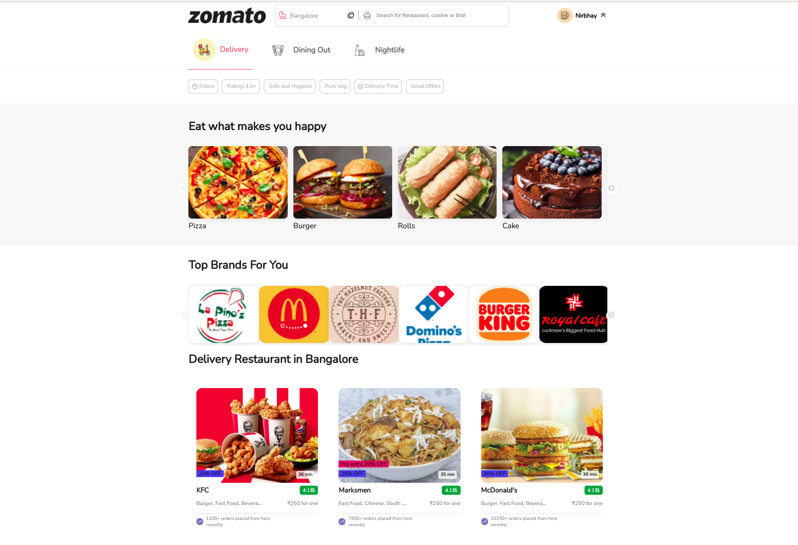
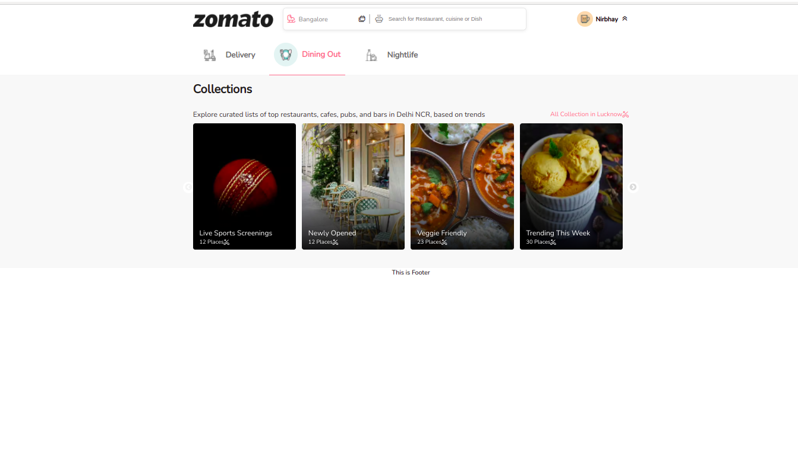

# zomato_web_clone

Clone the Zomato Website

Category Described into Three Parts

1-Header - Contained ALl The information ABout User and Zomato Logo is ALso There
2-By Default Delivery is There
3-Dinning Out
4-NightLIfe

Break Down Many Components in individual Components and use it there in Multiply Places

